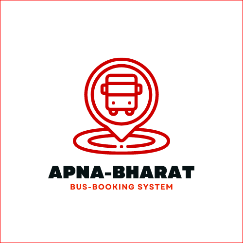

<div id="top">
  
# ApnaBharat-Bus-Booking-Reservation-System

<div align="center">

<a href="https://github.com/Pranjal360Agarwal/ApnaBharat-Bus-Booking-Reservation-System"></a>
<a href="https://github.com/Pranjal360Agarwal/ApnaBharat-Bus-Booking-Reservation-System"></a>
<a href="https://github.com/Pranjal360Agarwal/ApnaBharat-Bus-Booking-Reservation-System"></a>
<a href="https://github.com/awantika10/Desgen/blob/gssoc/LICENSE"></a>
<a href="https://discord.com/invite/bhUgbMZ2"></a>

<a href="https://github.com/Pranjal360Agarwal/ApnaBharat-Bus-Booking-Reservation-System/watchers"></a>
<a href="https://github.com/Pranjal360Agarwal/ApnaBharat-Bus-Booking-Reservation-System/graphs/contributors"></a>
<a href="https://github.com/Pranjal360Agarwal/ApnaBharat-Bus-Booking-Reservation-System/stargazers"></a>
<a href="https://github.com/Pranjal360Agarwal/ApnaBharat-Bus-Booking-Reservation-System/network/members"></a>
<a href="https://github.com/Pranjal360Agarwal/ApnaBharat-Bus-Booking-Reservation-System/issues"></a>
<a href="https://github.com/Pranjal360Agarwal/ApnaBharat-Bus-Booking-Reservation-System/issues?q=is%3Aissue+is%3Aclosed"></a>
<a href="https://github.com/Pranjal360Agarwal/ApnaBharat-Bus-Booking-Reservation-System/pulls"></a>
<a href="https://github.com/Pranjal360Agarwal/ApnaBharat-Bus-Booking-Reservation-System/pulls?q=is%3Apr+is%3Aclosed"></a>

</div>

---

</div>
<div align="center" height="50%">
  
</div>

---

Bus Reservation System is a pretty fully functional system developed using Tkinter (GUI), SQLite, and Python, which is designed to automate online ticket purchasing through an easy online bus booking system. With the bus ticket reservation system, you can manage/book reservations, clients data and passenger lists, and can add new buses or new routes as an Operator admin. In the end, the user will have a proper ticket for his/her booking.

### (Feel free to fork &amp; make changes, don't forget to make a PR.)

# Table of contents

- [Workflow of Our Project](#workflow)
- [Detailed Process of ApnaBharat-Bus-Booking-Reservation-system](#process)
- [Our Pledge](#pledge)
- [Aim](#aim)
- [Technology Used](#tech)
- [Features](#features)
- [Guidelines](#guidelines)
- [Steps for contribution](#steps)
- [Open-source](#open-source)
- [Contributors](#contributors)

<a name="workflow"></a>

# Workflow of Our Project

📌 Programming Languages used: <br>
👉 Javascript and Python <br>

📌 User-interface <br>
👉 It is simple with a clear view. <br>

📌 Store information and data: <br>
👉 We have a secure storage box for our user data such as name, date, time, location and availability of tickets. <br>

📌 Developing ticket booking and payment processing features: <br>
👉 We have a booking feature that allows users to select the event they want to attend, choose the number of tickets, and make payment through a secure payment gateway. <br>

📌 Implementation of the ticket generation and delivery feature: <br>
👉 Once the user has successfully booked and paid for their tickets we generate the tickets and deliver them to the user through email or other digital means. <br>

<a name="process"></a>

# Detailed Process of ApnaBharat-Bus-Booking-Reservation-system

📌 User Registration <br>
👉 Users can register on the website by providing basic details such as name, contact number, email ID, and password. <br>

    📌 Bus Search
       👉 Users can search for buses based on various criteria such as source, destination, date of travel, type of bus, etc.

    📌 Seat Selection
       👉 After selecting the bus, users can choose their preferred seats from the available options

     📌 Payment
       👉 Users can make payment for the booking using various payment modes such as credit/debit cards, net banking, wallets, etc.

     📌 Confirmation
       👉 Once the payment is successful, users will receive a confirmation of their booking via email or SMS.

     📌 One can add a new bus

      📌 Add Route


---

📌 Check out our Blog on Hashnode
🔗 https://codeshivam28.hashnode.dev/apnabharat-bus-booking-reservation-system

📌 Check out our Blog on Medium
🔗 https://medium.com/@pranjal99agarwal/my-mentoring-experience-kharagpur-winter-of-code-kwoc-207b83a4ee43

---

<p align ="right"><a href = "#top">Back to top</a></p>
<a name="pledge"></a>
     
# Our Pledge
  
  #### The aim of the "Apnabharat bus booking reservation system" project is to provide a convenient and efficient way for users to book bus tickets online. This system will eliminate the need for users to stand in long queues at bus ticket counters and provide a hassle-free booking experience. The project aims to be user-friendly, easy to navigate, and secure. It will provide users with a variety of bus options to choose from, along with various payment modes, making it a one-stop solution for all their bus booking needs. The project aims to provide a seamless booking experience for users and help bus operators streamline their booking process.
  
<hr>
<a name="aim"></a>

# Our Aim

📌 Provide a simple user interface that will be easy to understand. <br>
📌 Choose the number of tickets they require, make secure payments, and receive their tickets on time. <br>
📌 User-friendly interface and optimized user experience to enhance the user's interaction and engagement with the platform. <br>
📌 Streamline the ticket booking process, and improve customer satisfaction. <br>
📌 A platform that is secure, fast, and easy to use for booking tickets. <br>

<hr>
<a name="tech"></a>

# Technology Used 🔭

I have developed this project using the below technology

• Python: All the business logic has been implemented in Python

• Tkinter: All the frontend interface has been made up using GUI(Graphical user interface)

• SQLite: SQLite database has been used as a database for the project(backend part)

<a name="features"></a>

# Features 🚀

• Built with Python 3.6, SQLITE3

• Seat Booking

• Checking booking seat

• Adding the bus details

• Showing the available buses and number of seats available while seat booking

• Added the features of adding new bus, route id etc. as an Operator Admin

• Ticket generation

<p align ="right"><a href = "#top">Back to top</a></p>

# Kharagpur Winter of Code'22 ❤❤

# Innogeeks Winter of Code'23 ❤❤

# GirlScript Summer of Code'23 ❤❤

:star: Feel free to use this project to make your first contribution to an open-source project on GitHub. Here, problems should be unique so that people learn as well as contribute together

:star: Learn, Revise and Contribute 😄❤

### This repository is open to all members of the GitHub community. Any member can contribute to this project!

<a name="guidelines"></a>

# Guidelines 🙋‍

    1. No spam pull requests
    2. No changes on the core part of the project

---

<a name="steps"></a>

# Steps For Contribution⚡

0. Star ⭐

1. Fork

2. Clone the forked repository.

```css
git clone https://github.com/<your-github-username>/ApnaBharat-Bus-Booking-Reservation-System
```

3. Navigate to the project directory.

```py
cd ApnaBharat-Bus-Booking-Reservation-System
```

4. Create a new branch.

```css
git checkout -b <your_branch_name>
```

5. Make changes.

6. Stage your changes and commit

```css
git add -A

git commit -m "<your_commit_message>"
```

7. Push your local commits to the remote repo.

```css
git push -u origin <your_branch_name>
```

8. Create a Pull Request.

9. Congratulations! 🎉 you've made your contribution.

<p align ="right"><a href = "#top">Back to top</a></p>

## [Click here to read in Hindi](README-hindi.md)

<a name="open-source"></a>

## Open Source Programs🚀


<a href="https://kwoc.kossiitkgp.org/"></a>


<a name="contributors"></a>

## Thanks to all Contributors 💪

Thanks a lot for spending your time helping this project grow. Thanks a lot! Keep rocking 🍻

[](https://github.com/Pranjal360Agarwal/ApnaBharat-Bus-Booking-Reservation-System/graphs/contributors)
<br><br>

<p align ="right"><a href = "#top">Back to top</a></p>
</div>

# Made with ❤ by [Pranjal Agarwal](https://github.com/Pranjal360Agarwal).
